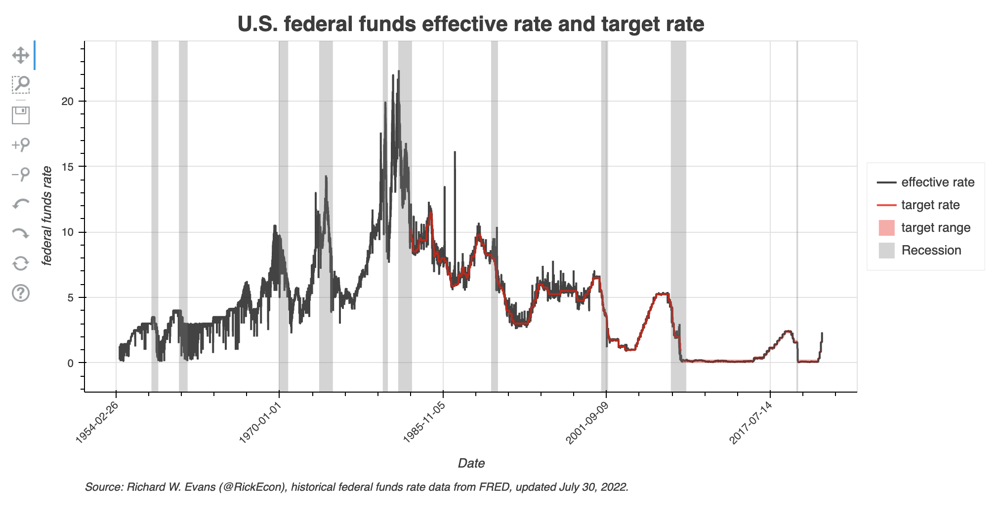
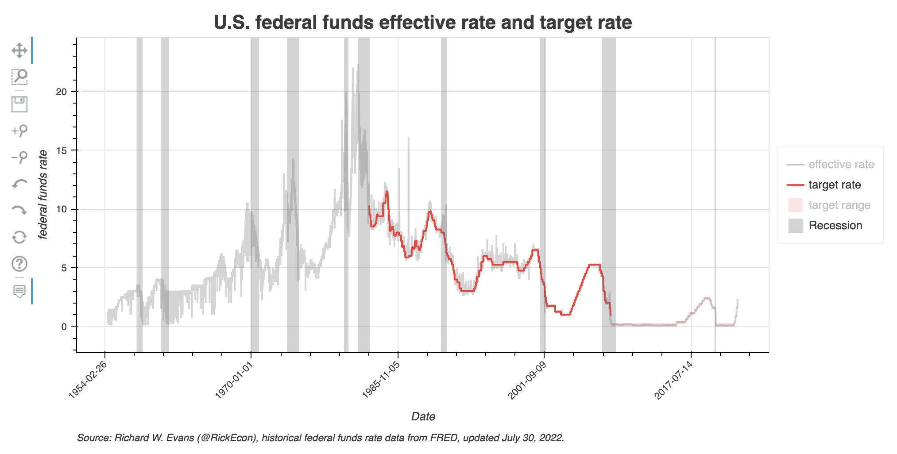
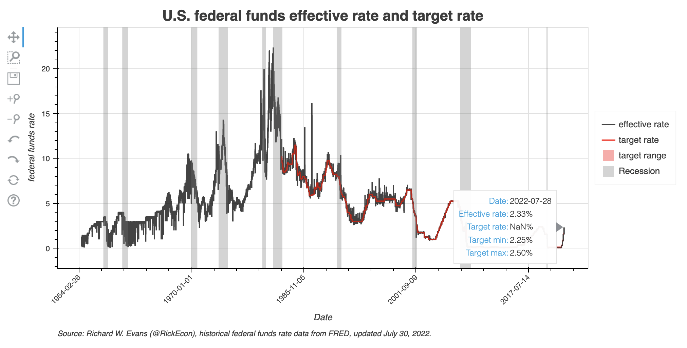
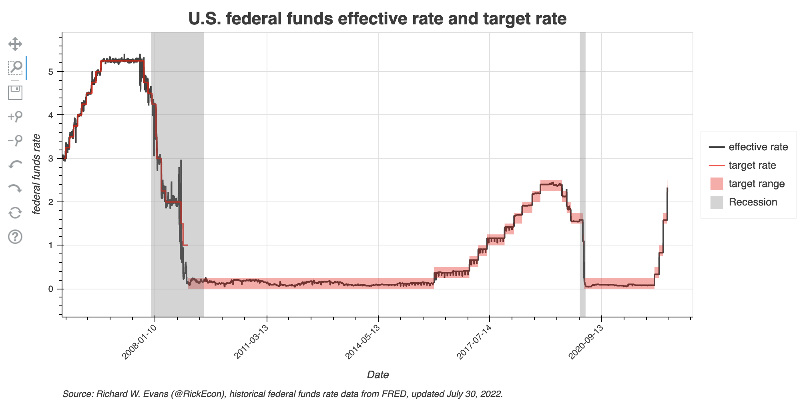

[](https://www.oselab.org/gallery)
[](https://www.python.org/downloads/release/python-382/)
[](https://codecov.io/gh/OpenSourceEcon/FedFundsPlot)

# Plot of U.S. Effective Federal Funds Rate and Target
The code in this repository allows the user to create a time series plot of the effective federal funds rate and its target by the Federal Reserve. The dynamic version of this plot, which is updated regularly, is available to manipulate and explore at [https://www.oselab.org/gallery/fedfundsrate](https://www.oselab.org/gallery/fedfundsrate). The core maintainer of this repository is [Richard Evans](https://sites.google.com/site/rickecon/) ([@RickEcon](https://github.com/rickecon)).

The federal funds rate is the interest rate that banks charge each other for overnight loans. Banks lend to each other on an overnight basis to meet reserve requirements on deposits set by the Federal Reserve. As such, the federal funds rate is an interest rate that is set by market interactions among thousands of banks each day and is not completely determined or controlled by the Federal Reserve. However, the Fed can manipulate this market by borrowing and lending in the overnight debt market of banks (see [Baughman and Caraplla, FEDS Notes, 2019](https://www.federalreserve.gov/econres/notes/feds-notes/federal-funds-rate-control-with-voluntary-reserve-targets-20190826.htm)). This plot shows the effective federal funds rate as compared to its target rate.

In December 2008, after it was clear that the Fed was going to have to lower the fed funds rate to near zero as the Global Financial Crisis of was in full swing, the Fed moved from a policy of reporting a fed funds rate target to reporting a fed funds rate range with a lower bound and upper bound. From December 2008 to March 2022--with a brief interlude of slightly increased rates from December 2015 to March 2020--the lower bound of the federal funds rate target was 0.00% and the upper bound was 0.25%. This was the practical way to implement a near-zero federal funds rate, when that rate is market determined and cannot be below zero.

The following figure is a screen shot of the federal funds rate plot downloaded on July 29, 2022 (effective and target rates at the close of July 29, 2022).



This `README.md` is organized into the following three sections.
1. [Running the code and generating the dynamic visualization](README.md#1-running-the-code-and-generating-the-dynamic-visualization)
2. [Functionality of the dynamic visualization](README.md#2-functionality-of-the-dynamic-visualization)
3. [Contributing to this visualization code](README.md#3-contributing-to-this-visualization-code)

## 1. Running the code and generating the dynamic visualization
The code for creating this visualization is written in the [Python](https://www.python.org/) programming language. It requires the following file:
* [`fedfunds_plot.py`](fedfunds_plot.py): a Python module that defines two functions in order to create the HTML and JavaScript for the dynamic visualization of the U.S. federal funds effective rate and target.
    * [`get_fedfunds_data()`](fedfunds_plot.py#L28) takes inputs for the date ranges to plot and whether to download the data directly from [fred.stlouisfed.org](https://fred.stlouisfed.org/) or retrieve the data from a file saved previously on your local hard drive in the [data](data/) directory of this repository. Then the function collects, cleans, and returns the fed funds rate data.
    * [`ffrate_plot()`](fedfunds_plot.py#L114) creates the dynamic visualization of the federal funds rate time seriesplot. This script calls the [`get_fedfunds_data()`](fedfunds_plot.py#L28) function. It then uses the [`Bokeh`](https://bokeh.org/) library to create a dynamic visualization using HTML and JavaScript to render the visualization in a web browser.

The most standard way to successfully run this code if you are using the [Anaconda distribution](https://www.anaconda.com/products/individual) of Python is to install and activate the `fedfunds-plot-dev` [conda environment](https://docs.conda.io/projects/conda/en/latest/user-guide/concepts/environments.html) defined in the [environment.yml](environment.yml) file, then run the [`fedfunds_plot.py`](fedfunds_plot.py) module as a script with the defaults or import the [`fedfunds_plot.py`](fedfunds_plot.py) module and run the [`ffrate_plot()`](fedfunds_plot.py#L114) function using the appropriate options. Use the following steps.
1. Either fork this repository then clone it to your local hard drive or clone it directly to your local hard drive from this repository.
2. Install the [Anaconda distribution](https://www.anaconda.com/products/individual) of Python to your local machine.
3. Update `conda` and `anaconda` by opening your terminal and typing `conda update conda` and following the instructions, then typing `conda update anaconda` and following the instructions.
4. From the terminal (or Conda command prompt), navigate to the directory to which you cloned this repository and run `conda env create -f environment.yml`. This will create the conda environment with all the necessary dependencies to run the script to create the dynamic visualization.
5. Activate the conda environment by typing in your terminal `conda activate fedfunds-plot-dev`.
6. Create the visualization in one of two ways.
    * Run the [`fedfunds_plot.py`](fedfunds_plot.py) module as a script with the default settings of the [`ffrate_plot()`](fedfunds_plot.py#L114) function. This will produce the dynamic visualization in which the data are downloaded from the internet, the end date is either the current day or the most day fed funds effective rate or target rate data.
    * Import the  [`fedfunds_plot.py`](fedfunds_plot.py) module and execute the [`ffrate_plot()`](fedfunds_plot.py#L114) function by typing something like the following:
    ```python
    import fedfunds_plot as ffp

    ffp.ffrate_plot(beg_date="1977-01-01", end_date="most recent")
    ```
7. Executing the function [`ffrate_plot()`](fedfunds_plot.py#L114) will result in two output objects: the dynamic visualization HTML file and the federal funds effective rate and target rate time series data.
    * [**images/ffrate_[YYYY-mm-dd].html**](images/ffrate_2022-07-29.html). This is the dynamic visualization. The code in the file is a combination of HTML and JavaScript. You can view this visualization by opening the file in a web browser window. A version of this visualization is updated regularly on the web at [https://www.oselab.org/gallery/fedfundsrate](https://www.oselab.org/gallery/fedfundsrate).
    * [**data/ffrates_[YYYY-mm-dd].csv**](data/ffrates_2022-07-29.csv). A comma separated values data file of the original time series of the federal funds effective rate and target rates from `beg_date` to whatever end date is specified in the [`ffrate_plot()`](fedfunds_plot.py#L114) function arguments, which end date is also the final 10 characters of the file name `YYYY-mm-dd`.

## 2. Functionality of the dynamic visualization
This dynamic visualization allows the user to customize some different views and manipulations of the data using the following functionalities. The default view of the visualization is shown above.
* Highlight or mute any of the four time series shown in the plot--federal funds effective rate, target rate, target range, or recession--by clicking on the series label in the legend on the right side of the plot. The screen shot below shows a version of the plot in which all the time series have been muted except for the federal funds target rate series. Note that even when muted, the time series are still faintly visible.

*  Hovertool display is permanently selected and, therefore, not included in the option buttons on the left side of the plot. If you select hover over any data in the plot, a dialogue box will be displayed with the underlying data values at that point..

*  Pan different areas of the data. If you click on the pan button  on the left side of the plot, you can use your cursor to click and drag on the data window and change your view of the data.
*    Zoom in or out on the data. You can zoom in or zoom out on the data series in three different ways. You can use the box zoom functionality by clicking on its button  on the left side of the plot and clicking and dragging a box on the area of the plot that you want to zoom in on. You can also zoom in by clicking on the zoom in button  on the left side of the plot, then clicking on the area of the plot you want to center your zoom in around. Or you can zoom out by clicking on the zoom out button  on the left side of the plot, then clicking on the area of the plot you want to center your zoom out around. The screen shot below shows a zoomed in version of the plot.

*  Save current view of data as .png file. You can save your current view of the data as a .png file to your local hard drive by clicking on the save button  on the left side of the plot.
*   Undo and redo actions. You can undo or redo any of the plot changes that you make using the undo button  or the redo button  on the left side of the plot.
*  Reset the plot. After any changes you make to the plot, you can reset it to its original position by using the reset button  on the left side of the plot.

## 3. Contributing to this visualization code
If you wish to improve or enhance this code or if you find errors or bugs, please consider the following ways to contribute to this project.
* Browse the repository [Issues](https://github.com/OpenSourceEcon/FedFundsPlot/issues) for known areas that need attention.
* Submit questions or suggestions by submitting a new issue in the repository [Issues](https://github.com/OpenSourceEcon/FedFundsPlot/issues).
* Submit a pull request with your proposed changes.
